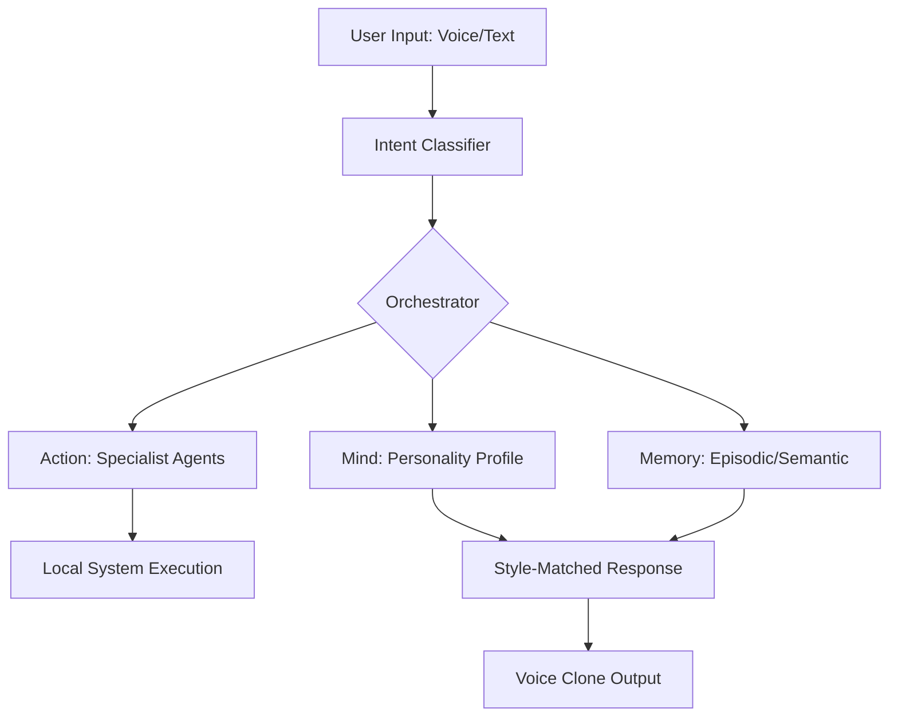

# ECHOME: Embedded Cognitive Human Operative Mirror Engine
**A High-Fidelity Digital Extension of Human Identity**

ECHOME is an elite, open-source framework designed to clone and automate a user's cognitive and behavioral identity across three fundamental pillars: **Mind**, **Voice**, and **Action**. Built for the modern AI/ML engineer, it provides a 100% local, zero-cost, and private-by-default alternative to cloud-based personality and agent systems.

---

## Technical Overview

ECHOME transitions from a high-precision psychometric assessment into a Jarvis-grade autonomous intelligence layer. It doesn't just assist; it mirrors your decision patterns, communication style, and technical judgment.

### Pillar 1: The Mind (Personality Engine)
A high-fidelity **Computerized Adaptive Testing (CAT)** system built on **Graded Response Models (GRM)**.
*   **Dimensionality:** Maps 8 scientific dimensions including Big Five (OCEAN), Cognitive Style, and Lifestyle patterns.
*   **Optimization:** Uses **Fisher Information** maximization to reduce assessment length by 70% while maintaining 90%+ confidence (Standard Error < 0.32).
*   **Estimation:** Employs **Maximum A Posteriori (MAP)** estimation to stabilize latent trait (Theta) recovery.

### Pillar 2: The Voice (Voice Clone Engine)
A custom, local pipeline for zero-shot speaker replication.
*   **Capture:** Uses **Whisper (Local)** for ASR.
*   **Cloning:** Extracts a 256-dim d-vector vocal fingerprint via **Resemblyzer**.
*   **Synthesis:** Employs **XTTSv2** and **HiFi-GAN** for high-fidelity, low-latency 22kHz audio generation.

### Pillar 3: The Action (Agent Framework)
An autonomous orchestration layer using **LangGraph** and a 3-tier memory system.
*   **Orchestration:** Multi-agent routing via **LangGraph** for complex task execution.
*   **Memory (CoALA):** Persistent **Episodic**, **Semantic**, and **Procedural** memory stored in a local **Qdrant** vector database.
*   **Specialists:** Dedicated agents for Bash execution, Python REPL, and technical architecture analysis.

---

## System Architecture



---

## Installation & Deployment

### Prerequisites
*   Python 3.10+
*   NVIDIA GPU (Recommended for Voice Engine)
*   Docker & Docker Compose

### Quick Start
```bash
# Clone the repository
git clone https://github.com/Lourdhu02/echome.git
cd echome

# Install dependencies
pip install -r requirements.txt

# Generate the calibrated item bank
python generate_real_items.py

# Launch the engine
uvicorn src.assessment_app:app --reload
```

### Containerized Environment
```bash
docker-compose up --build
```

---

## Performance Targets
*   **Inference Latency:** < 500ms (Text) / < 1.5s (Voice)
*   **Personality Match:** 85%+ similarity to user writing style.
*   **Memory Recall:** 90%+ accuracy on episodic events.
*   **Privacy:** 100% Local. Zero telemetry. Zero Cloud dependencies.

---

## Repository Structure
*   `src/assessment_app.py` - Core API & Mind Engine
*   `src/orchestrator.py` - LangGraph Agent Routing
*   `src/voice_engine.py` - XTTSv2 Voice Clone Pipeline
*   `src/memory_manager.py` - CoALA Memory System
*   `src/cat_engine.py` - IRT & MAP Optimization Logic
*   `src/agents/` - Specialist Autonomous Agents

---

## License
Distributed under the **MIT License**. See `LICENSE` for more information.

---
**Engineered with precision by Raju**  
*AI/ML Engineer | Building the future of personalized intelligence.*
